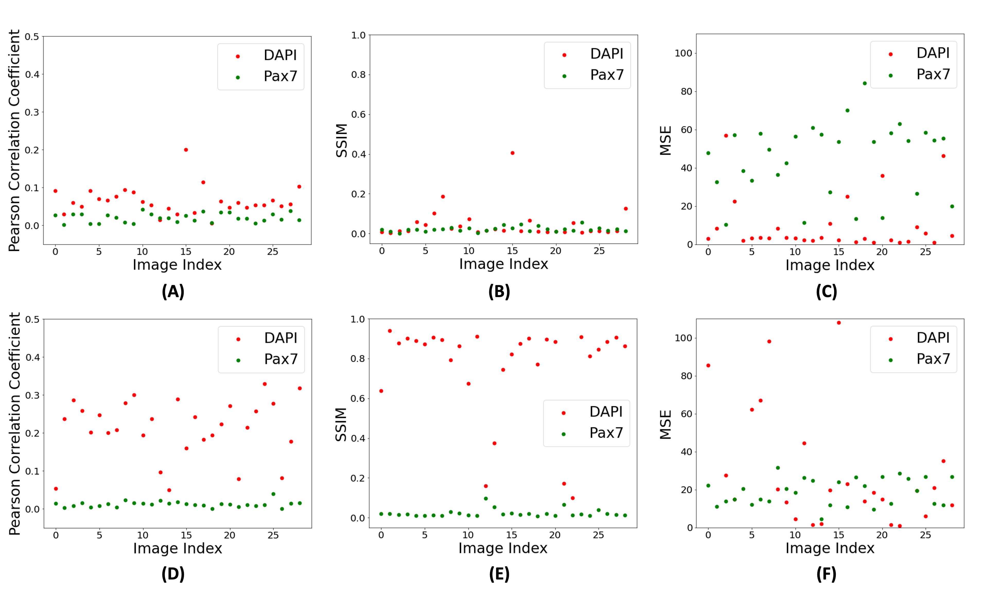

# BSC Fluorescence Prediction

This repository is for the article **"Fluorescent marker prediction for non-invasive optical imaging in bovine satellite cells using deep learning"**, published in Frontiers in Artificial Intelligence.

- Preprint: [doi: 10.48550/arXiv.2410.13685](https://doi.org/10.48550/arXiv.2410.13685)
- Final Paper: [doi: 10.3389/frai.2025.1577027](https://doi.org/10.3389/frai.2025.1577027)

### Processing & Analysis Scripts:
- `background_scan.py`: Normalization of images using average whitescan (preprocessing)
- `contrast.py`: Preprocessing the image data to make the contrast better and the image sharper
- `dump_array.py`: Dump array into a txt view for manual inspection
- `eval.py`: Evaluation script including several different parameters like MSE, SSIM, and Pearson Correlation Coefficient
- `flip_color.py`: Using color palette chaging methods to visualize and inspect noisy images to get a better view of cells
- `jpg_to_tif.py`: Changing jpg files to tif format
- `make_csv.py`: Script to iterate raw file storage data and generate csv with file paths used by model
- `make_gs.py`: Convert multi-channel tifs into single channel grayscale tif
- `make_rgb`: Map model-generated grayscale output into a color palette for better visualization
- `overlay.py`: Overlay two images on top of each other
- `split.py`: Test/Train split
- `tif_to_jpeg.py`: Changing tif files to jpeg for easy visualization of images
- `visualize.ipynb`: Visualization of evaluation results
- `images`: Directory containing relevant images of experiments

### Workflow for getting results:
- Run preprocessing on your data
    > Relevant Files: whitescan.py (Remove background noise from whitescan), flip_color.py (better visualization of images by mapping to color palettes)
- Change your images to tif
    > Relevant File: jpg_to_tif.py 
- Make a csv of all the tifs
    > Relevant File: make_csv.py
- Split into training and testing csvs
- Run model training on train csv
- Run model testing on test csv
- Run evaluations on predictions
    > Relevant File: eval.py

### Results

As shown in the figure above, MSE values increased with fluorescence denoising, indicating greater pixel-wise errors. However, visual assessment and improvements in Pearson correlation coefficient and SSIM values suggest better model performance with image pre-processing. This highlights MSE's limitations in capturing perceptual quality, spatial context, and signal-to-noise ratio, which are better addressed by SSIM. SSIM considers luminance, contrast, structure, and noise, making it more suitable for evaluating biological images.

### Data
Examples of the data is provided in the `sample_data` directory. For access to data used for our evaluations, please reach out to yijiyoon@msu.edu
